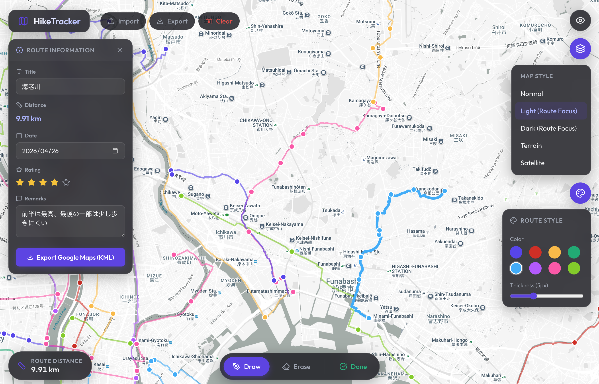
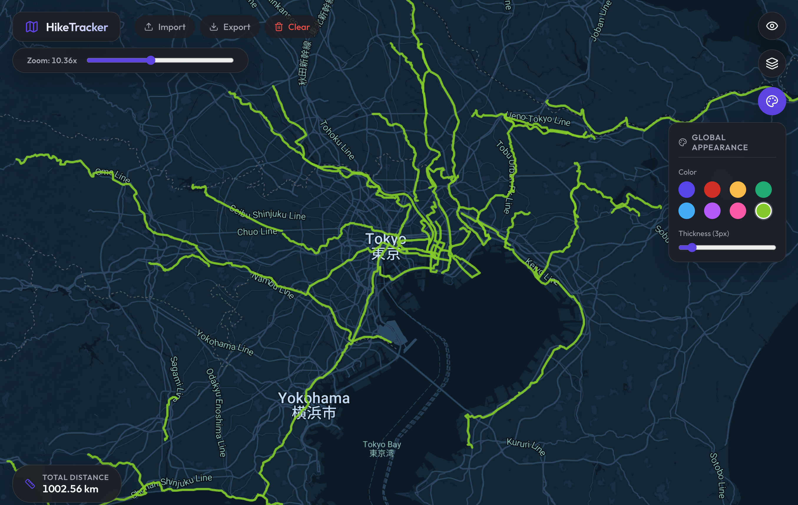

# HikeTracker 🏕️

HikeTracker is a highly interactive, web-based tool designed to trace, record, customize, and aestheticize your hiking and backpacking routes directly on Google Maps. 

Powered by **React 19**, **Vite**, and the official `@vis.gl/react-google-maps` library, HikeTracker automatically snaps your drawn paths to realistic roads and walking trails using the Google Directions API. It is designed with exceptional user experience, premium glassmorphic UI interactions, and beautiful cartography in mind.

<p align="center">
  
  
</p>

*Left: Route detail logs (Title, Date, Star Rating, Remarks) and KML Export on a custom Light (Route Focus) map theme. Right: Clean Global View and Screenshot mode on a Dark (Route Focus) map theme showcasing total cumulative distance.*

---

## ✨ Key Features

### 📝 Route Information & Logs (New)
* **Detailed Route Profiling**: Set a custom **Title** (e.g. "海老川"), log the exact hike **Date** via a calendar input, rate the experience with a **5-star interactive rating**, and write detailed **Remarks** about trail conditions or highlights.
* **Per-Route KML Export**: Instantly export individual routes directly from the detail panel as standard `.kml` files. Filenames are dynamically generated from the route title (e.g., `海老川.kml`), ready to be imported into Google Maps ("My Maps"), Google Earth, or handheld GPS units.

### 🎨 Custom Map Themes (New)
* Select from five customized cartographic styles to fit your aesthetic:
  * **Light (Route Focus)**: High-contrast light mode with muted background details, making colored routes pop.
  * **Dark (Route Focus)**: Sleek dark mode with vibrant neon route contrast.
  * **Normal**: Standard Google Maps view.
  * **Terrain**: Topographical elevation contours and shaded relief.
  * **Satellite**: Photographic satellite imagery.

### 🧭 Smart Path Drawing & Editing
* **Drawing Tool**: Click to plot waypoints. Coordinates talk to the Google Maps Directions API, snapping path segments to real-world pedestrian streets and hiking trails.
* **Auto-Anchor Insertion**: Click anywhere on an existing active polyline to automatically split the line and insert a draggable anchor exactly at the click location.
* **Anchor Refining & Erasing**: Grab and drag anchors to tweak paths, or switch to Erase mode to click and remove individual anchor points.
* **Route Isolation**: Manage multiple paths simultaneously. Only one route enters an active "Editing" state at a time, protecting others from accidental adjustments.

### 🌌 Global View & Screenshot Mode
* **Interaction Lock**: Activating Global View hides UI menus and removes all draggable anchor pins, locking map click events to prevent accidental modifications.
* **Unified Aesthetics**: Temporarily overrides all individual path styles with a single global color and thickness slider (2px to 12px) to create clean, uniform maps.
* **Fractional Zoom**: Accesses a fluid, continuous zoom slider for micro-camera tuning before taking screenshots.
* **Total Distance**: Displays the cumulative distance of all trails combined (with automatic scaling between meters and kilometers).

### 💾 Universal State & Safety
* **Full Backup Export**: Download a full **JSON** workspace backup including all routes, metadata, and editable anchors.
* **Auto-Saving**: Never lose progress—your routes are cached dynamically inside `localStorage`.
* **Safe Reset**: Protects data with confirmation checks prompting you to export a backup before clearing.

---

## 🛠 Tech Stack

* **Frontend**: React 19 (Hooks, Context, standard state isolation)
* **Build tool**: Vite 8
* **Map integration**: `@vis.gl/react-google-maps` (Official React wrapper for Google Maps JS SDK)
* **Geometry Engine**: Google Maps API Geometry library
* **Icons**: `lucide-react`
* **Styling**: Vanilla CSS (glassmorphism overlay panels, responsive controls)

---

## 🚀 Getting Started

### Prerequisites
Make sure you have Node.js installed. You will also need a Google Cloud Console account with billing enabled to obtain a Maps API Key.

### API Requirements
Ensure the following Google Cloud API libraries are enabled for your API key:
- **Maps JavaScript API**
- **Directions API**

### Installation & Run

1. **Clone the repository** and navigate to the root directory.
2. **Install dependencies**:
   ```bash
   npm install
   ```
3. **Configure environment variables**: Create a `.env` file in the root directory:
   ```env
   VITE_GOOGLE_MAPS_API_KEY=YOUR_GOOGLE_MAPS_API_KEY_HERE
   ```
4. **Start the development server**:
   ```bash
   npm run dev
   ```

---

## 📸 Adding Screenshots to the README

We have prepared a `screenshots/` directory at the project root to host your image files. To place the two screenshots you provided into the README, please follow these steps:

1. **Locate your screenshots** on your local machine.
2. **Save the images** inside the `screenshots/` directory of the project:
   * Save the **light-themed Route Details screen** as: `screenshots/route_edit_light.png`
   * Save the **dark-themed Global Appearance screen** as: `screenshots/global_view_dark.png`
3. **Commit the images** to your Git repository:
   ```bash
   git add screenshots/
   git commit -m "docs: add screenshots to screenshots directory"
   ```

Once committed and pushed to your remote repository (e.g., GitHub), the screenshots will render side-by-side automatically in the README!

---

## 📝 Performance & Limits
* HikeTracker is a local-first static progressive web app. 
* While Google Maps renders raw polylines with high performance, having over **1,000+ interactive editable anchors** simultaneously visible on the map can impact browser frame rates. Switch to **Global View Mode** to temporarily disable anchor markers for absolute performance.
* Local storage has a ~5MB storage limit, which safely holds dozens of long routes. Export a workspace **JSON** backup regularly for large-scale multi-route records.
